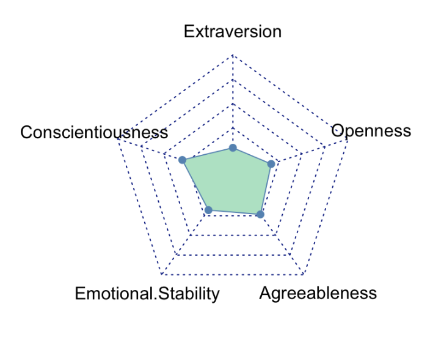

```{r setup, include=FALSE}
library(flexdashboard)
library(fmsb)
library(ggplot2)
library(plotly)
library(tidyr)
library(dplyr)

data <- read.csv("data_cleaned_with_average.csv", stringsAsFactors = FALSE)
```

Abstract
===================================================================
Sidebar {data-width=1000}
-------------------------------------
### Total participants
```{r}

valueBox(117, 
         caption = 'Total participants', 
         icon = 'fa-users')
```
### Usable participants
```{r}

valueBox(67, 
         caption = 'Usable participants', 
         icon = 'fa-user')
```
### Questions in our survey
```{r}

valueBox(11, 
         caption = 'Questions in our survey', 
         icon = 'fa-question')
```
### Average popularity score
```{r}

valueBox(62.7, 
         caption = 'Average popularity score', 
         icon = 'fa-fire')
```
Column {data-width=500}
-----------------------------------------------------------------------

### Correlation between the five personality types and the popularity of music
```{r}
#print(data)
# data prep
cc_average_extraversion <- cor(data$filtered_avg_popularity, data$extraversion_score)
cc_average_agreeableness <- cor(data$filtered_avg_popularity, data$agreeableness_score)
cc_average_conscientiousness <- cor(data$filtered_avg_popularity, data$conscientiousness_score)
cc_average_emotional_stability <- cor(data$filtered_avg_popularity, data$emotionalStability_score)
cc_average_openness <- abs(cor(data$filtered_avg_popularity, data$opennessToExperiences_score))

# data vis
data_vis <- c("Extraversion" = cc_average_extraversion, "Conscientiousness" = cc_average_conscientiousness, "Emotional Stability" = cc_average_emotional_stability, "Agreeableness" = cc_average_agreeableness, "Openness" = cc_average_openness)

data_visualisation <- data.frame(t(data_vis))

final_data_vis <- data.frame(rbind(rep(1,5), rep(0,5), data_visualisation))
# we're adding a picture of this visualization, because, for some reason, the chart comes out really tiny
#radarchart(final_data_vis, pcol = c("#4682B4"), pfcol = c("#9FE2BF"))
```


### Average playlist popularity per personality trait
```{r}
long_data <- data %>%
     pivot_longer(cols = ends_with("_score"), 
                names_to = "score_category", 
                values_to = "score_value")

get_avrg_by_trait_score <- function(trait, score) {
  filtered <- df %>%
      filter({{trait}} == score)
    
  return(mean(filtered$filtered_avg_popularity))
}

density_data <- long_data %>%
  group_by(score_category, score_value) %>%
  summarise(avgPop = mean(filtered_avg_popularity), .groups = 'drop') %>%
  ungroup()

all_combinations <- expand.grid(score_category = unique(long_data$score_category),
                                 score_value = unique(long_data$score_value))

complete_density_data <- left_join(all_combinations, density_data, by = c("score_category", "score_value")) %>%
     replace_na(list(count = 0))

change_names <- function(name) {
  result <- switch(
    c(name),
    extraversion_score = "Extraversion",
    agreeableness_score = "Agreeableness",
    conscientiousness_score = "Conscientiousness",
    emotionalStability_score = "Emotional stability",
    opennessToExperiences_score = "Openness",
    "N/A"
  )
  return(result)
}

formatted_data <- complete_density_data %>%
    rename("Average\npopularity" = avgPop) %>%
    rowwise() %>%
    mutate(score_category = change_names(score_category))

p <- ggplot(formatted_data, aes(x = score_value, y = score_category, fill = `Average\npopularity`)) +
    geom_tile() +
    scale_fill_gradient(low = "#EDF178", high = "#F24B4B") +
    labs(x = "Score", y=NULL) +
    theme_minimal()

ggplotly(p) %>% layout(
  legend = list(
    x = 0,  # Adjust the x position of the legend
    y = -5,  # Increase the y position to move the legend higher
    traceorder = "normal"  # Maintain the order of legend items
  )
)
```

Column {data-width=500}
-----------------------------------------------------------------------

### Introduction
Our investigation into the link between personality and choice of mainstream music transcends mere curiosity as its is a question that subtly influences us on a daily basis.

Prevailing stereotypes dictate that the average mainstream music enjoyer embody certain characteristics such as extraversion whereas those who are entrenched in niche musical subcultures are perceived differently (more open for example), leading us to make assumptions regarding those around us. While this is a common bias, it is also one that we see be disproven time and time again. Why then do these stereotypes live on? Could it be that there is a validity to linking traits such as extreme extraversion with affinity towards popular music or are there other qualities such as agreeableness that predict this affinity better?

This plays an even bigger role when we take into consideration the social aspect of music and how it is a tool to connect people. Regardless of where one falls on the OCEAN (Openness, Conscientiousness, Extraversion, Agreeableness, and Neuroticism) scale (Neuroticism is known as Emotional Stability in the TiPi model which is the exact opposite), your preferences may align with someone who seemingly falls on the opposite side. Thus making the closer examination of the intersection between personality and popularity even more intriguing.

### Our findings
As signified in the radar chart labeled »Correlation between the five personality types and the popularity of music« the TiPi traits did not have equal effects on song popularity. Their absolute effect can be ranked from strongest to weakest as: conscientiousness, agreeableness, openness to experiences, emotional stability and extraversion. However, the only statistically significant effects were that of conscientiousness and agreeableness.

It should be noted that openness to experiences has a negative effect, which is in line with our initial expectations.

What we did not expect was the statistical insignificance of openness to experiences and extraversion as we believed that higher scores in those categories would result in listening to much more popular songs (or less popular songs in the case of openness to experiences).

Another shock was the statistical significance of agreeableness as we expected that it would not be a significant determinant as we believed more compassionate people would listen to both popular and unpopular songs.


Methodology  {data-orientation=columns}
===================================

Column {.bg-grey}
-----------------------------------------------
###


Column {data-width=300}
-----------------------------------------------
### General methodology background
The Intersection of personality & music listening is one that has been heavily studied by several researchers with focus being placed on the relationship between preferences for musical attributes and personality (Greenberg, Kosinski et al. 2016) or music listening behavior on Spotify and personality (Anderson, Gil, Greenberg, 2020) for example. 

This fascination with music's inherent interplay with personality is what lead us to our research question: Is personality a significant predictor of whether someone listens to mainstream or non mainstream music? In our case personality being measured using a shortened version of the big five inventory - the TiPi test. 

We decided that this instrument for personality measurement was best suited for our study due to its accessibility (as people are more likely to finish a shorter questionnaire) and efficiency. Additionally the metrics of Openness, Conscientiousness, Extraversion, Agreeableness, and Emotional Stability are ones that have cross-cultural applicability, standardized scoring and interpretation, and are widely accepted comprehensive frameworks. 

Additionally popularity was chosen as the track feature we will be measuring personality against, as it sheds light on inclinations towards music that align with prevailing trends or deviate to more niche choices thus adding our own particular angle on the wider lens of personality and music taste.

We will be using Spotify, specifically the Spotify “On Repeat” Playlist data of participants in order to analyze their music listening data as this playlist represents tracks that are most up to date with the participants listening repertoire. 

Our study hopes to ultimately culminate in a deeper understanding of how individual psychological characteristics influence music preferences and contribute to the ever evolving conversation regarding the relationship between music and personality

### The 10 TiPi questions {data-height=350}
All answered on a 7-point likert scale

I see myself as:

1. _____ Extraverted, enthusiastic.
2. _____ Critical, quarrelsome.
3. _____ Dependable, self-disciplined.
4. _____ Anxious, easily upset.
5. _____ Open to new experiences, complex.
6. _____ Reserved, quiet.
7. _____ Sympathetic, warm.
8. _____ Disorganized, careless.
9. _____ Calm, emotionally stable.
10. _____ Conventional, uncreative.

Column {data-width=250}
----------------------------------------------
### Example of an "On-repeat" playlist

<iframe src="https://open.spotify.com/embed/playlist/37i9dQZF1EpwjzNpkdLsU1" width="100%" height="100%" frameborder="0" allowfullscreen="" allow="autoplay; clipboard-write; encrypted-media; fullscreen; picture-in-picture">
</iframe>
Openness {data-navmenu="Results"}
==========================================
Charts
-------------------------------
### Correlation chart
```{r}
p <- ggplot(data, aes(x = opennessToExperiences_score, y = filtered_avg_popularity)) +
  geom_point() +  
  geom_smooth(method = "lm", color="#EC9595", se = TRUE) +  
  labs(x = "Openness Score", y = "Filtered Average Popularity", 
       title = "Scatterplot of Openness Score vs Filtered Average Popularity") +
  theme_minimal()

ggplotly(p)
```

### Distribution
```{r}
p <- ggplot(data, aes(x = opennessToExperiences_score)) +
   geom_density(fill = "#EC9595", alpha = 0.5) +
   labs(title = "Density Plot of Openness Score", x = "Openness Score", y = "Density") + xlim(0,10) + ylim(0, 0.5) + theme_minimal()

ggplotly(p)
```

Description
--------------------------------------
### Chart Description
*Openness to experiences* signifies a person's ability to accept new ideas and new experiences (Psychology Today Staff, n.d.). Higher levels of openness correspond with seeking out new experiences more actively, having a broader set of interest, and being more comfortable with the unknown (Cherry, 2023). Initially we predicted that participants with higher scores in this category will have lower average popularity scores as they would be open to listening to more obscure artists.

Peoplewere on average open to experiences with a score of 5.537/7 which is similar to but slightly above the global average of 5.38/7 (Gosling et al., 2003).

We noticed a small trend of average popularity scores decreasing with increasing openness scores. This does correspond with our initial thoughts. However, the correlation of -0.1651 is weak, and the t-statistic of -1.35 is not statistically significant at 5%, so we cannot make any concrete inferences regarding its effect (the effect is practically 0).

Conscientiousness {data-navmenu="Results"}
==========================================
Charts
-------------------------------
### Correlation chart
```{r}
p <- ggplot(data, aes(x = conscientiousness_score, y = filtered_avg_popularity)) +
  geom_point() +  
  geom_smooth(method = "lm", color="#E3EBA7", se = TRUE) +  
  labs(x = "Conscientiousness Score", y = "Filtered Average Popularity", 
       title = "Scatterplot of Conscientiousness Score vs Filtered Average Popularity") +
  theme_minimal()

ggplotly(p)
```

### Distribution
```{r}
p <- ggplot(data, aes(x = conscientiousness_score)) +
    geom_density(fill = "#E3EBA7", alpha = 0.5) +
    labs(title = "Density Plot of Conscientiousness Score", x = "Conscientiousness Score", y = "Density") + xlim(0,10) + ylim(0, 0.5) + theme_minimal()

ggplotly(p)
```

Description {data-height=300}
--------------------------------------
### Chart Description
*Conscientiousness* signfies a person's tendency to be goal-oriented, organized and their ability to adhere to rules (Psychology Today Staff, n.d.). Higher levels of conscientiousness correspond with a tendency to plan ahead and to think about the effects of their actions on others (Cherry, 2023). Initially we predicted that participants with higher scores in this category will have higher average popularity scores as they would conform to social norms more and think of their choices relative to others.

People were on conscientious with a score of 4.799/7 which is much lower than the global average of 5.4/7 (Gosling et al., 2003).

We noticed a trend of average popularity scores increasing with increasing conscientiousness scores. This does correspond with our initial thoughts. The correlation of 0.298 is the strongest out of all the traits, and the t-statistic of 2.56 is statistically significant at 5%, so we can infer that an increase in conscientiousness leads to an increase in average popularity scores of playlists (ceteris paribus).


Extraversion {data-navmenu="Results"}
==========================================
Charts
-------------------------------
### Correlation chart
```{r}
p <- ggplot(data, aes(x = extraversion_score, y = filtered_avg_popularity)) +
  geom_point() +  
  geom_smooth(method = "lm", color="#008080", se = TRUE) +  
  labs(x = "Extraversion Score", y = "Filtered Average Popularity", 
       title = "Scatterplot of Extraversion Score vs Filtered Average Popularity") +
  theme_minimal()

ggplotly(p)
```

### Distribution
```{r}
p <- ggplot(data, aes(x = extraversion_score)) +
  geom_density(fill = "#008080", alpha = 0.5) +
  labs(title = "Density Plot of Extraversion Score", x = "Extraversion Score", y = "Density") + xlim(0,10) + ylim(0, 0.5) + theme_minimal()

ggplotly(p)
```

Description
--------------------------------------
### Chart Description
*Extraversion* signifies a person’s tendency to be outgoing and talkative with the opposite being introversion (Psychology Today Staff, n.d.). High levels of extroversion correspond with enjoying meeting new people, having wide social circles and replenishing energy in social situation (Cherry, 2023). Initially we predicted that participants with higher scores in this category will have higher average popularity scores as they would listen to more music with a wider appeal and that would spark more conversation.

People were on average extraverted with a score of 4.246/7 which is similar to but slightly below the global average of 4.44/7 (Gosling et al., 2003).

We noticed a slight trend of average popularity scores increasing with increasing extraversion scores, although that effect was close to 0. This does not correspond with our initial thoughts. The calculated correlation of 0.0448 is weak, and the t-statistic of 0.28 is not statistically significant at 5%, so we cannot make any concrete inferences regarding its effect (the effect is practically 0).

Agreeableness {data-navmenu="Results"}
==========================================
Charts
-------------------------------
### Correlation chart
```{r}
p <- ggplot(data, aes(x = agreeableness_score, y = filtered_avg_popularity)) +
  geom_point() +  
  geom_smooth(method = "lm", color="#008020", se = TRUE) +  
  labs(x = "Agreeableness Score", y = "Filtered Average Popularity", 
       title = "Scatterplot of Agreeableness Score vs Filtered Average Popularity") +
  theme_minimal()

ggplotly(p)
```

### Distribution
```{r}
p <- ggplot(data, aes(x = agreeableness_score)) +
     geom_density(fill = "#008020", alpha = 0.5) +
                 labs(title = "Density Plot of Agreeableness Score", x = "Agreeableness Score", y = "Density") + xlim(0,10) + ylim(0, 0.5) + theme_minimal()

ggplotly(p)
```

Description
--------------------------------------
### Chart Description
*Agreeableness* signifies the person's tendency to be cooperative, friendly and kind (Psychology Today Staff, n.d.). High levels of agreeableness correspond with more cooperation, while low levels correspond with more competition (Cherry, 2023). Initially we predicted that agreeableness would not have a significant effect as compassionate people can listen to both popular or unpopular music.

People were on average agreeable with a score of 4.433/7 which is much lower than the global average of 5.23/7 (Gosling et al., 2003).

We noticed a trend of average popularity scores increasing with increasing agreeableness scores. This does not correspond with our initial thoughts. However, the calculated correlation of 0.233 is relatively strong, and the t-statistic of 2.28 is statistically significant at 5%, so we can infer that an increase in agreableness leads to an increase in average popularity scores of playlists (ceteris paribus).

Emotional Stability {data-navmenu="Results"}
==========================================
Charts
-------------------------------
### Correlation chart
```{r}
p <- ggplot(data, aes(x = emotionalStability_score, y = filtered_avg_popularity)) +
  geom_point() +  
  geom_smooth(method = "lm", color="#008080", se = TRUE) +  
  labs(x = "Emotional Stability Score", y = "Filtered Average Popularity", 
       title = "Scatterplot of Emotional Stability Score vs Filtered Average Popularity") +
  theme_minimal()

ggplotly(p)
```

### Distribution
```{r}
p <- ggplot(data, aes(x = emotionalStability_score)) +
     geom_density(fill = "#A7EBA8", alpha = 0.5) +
     labs(title = "Density Plot of Emotional Stability Score", x = "Emotional Stability Score", y = "Density") + xlim(0,10) + ylim(0, 0.5) + theme_minimal()

ggplotly(p)
```
Description
--------------------------------------
### Chart Description
_Emotional stability_ is the opposite of Neuroticism in the big five inventory test. Neuroticism is a person's tendency towards negative feelings  (Psychology Today Staff, n.d.). Emotionally stable people are more emotionally resilient, experience fewer mood swings, and are less susceptible to anxiety and depression (Cherry 2023). Initially we predicted the effect would be insignificant as popular songs can be of any genre, both happy or sad, which corresponds to any level of emotional stability.

People were on average emotionally stable with a score of 4.284/7, which is lower than the global average of 4.83/7 (Gosling et al., 2003).

We noticed a slight trend  of average popularity scores increasing with increasing emotional stability scores, although that effect was close to 0. This does correspond with our initial thoughts. However, the correlation of 0.1785 is weak, and the t-statistic of 0.48 is not statistically significant at 5%, so we cannot make any concrete inferences regarding its effect (the effect is practically 0).

Evaluation/Reflection {data-orientation=columns, .bg-grey}
=======================================
Conclusion {.bg-grey}
------------------------------------
###


Background {data-orientation=columns}
=======================================

Article reviews {.tabset .tabset-fade data-width=600}
-------------------------------------
### Market concentration
Over the last couple of decades, music consumption has shifted from purchasing individual records and listening to the radio to a single digital application that fits into your pocket. This era of digitalization is dominated by a fistful of firms and platforms, that manage to concentrate the market and therefore obtain massive potential leverage. Luis Aguiar and Joel Waldfogel (2021) aim to study the effect of such influence by digital companies by using the case of Spotify in their article Platforms, Power, and Promotion: Evidence from Spotify Playlists. The authors use Spotify as an example as it, combined with Apple Music, represents almost 55% of all global music streaming subscriptions. With such market concentration, the potential for antitrust problems arises. Therefore, the authors wish to quantify Spotify’s market power and evaluate if further scrutiny is needed when dealing with these platforms. They particularly focus on Spotify’s playlists, as the company manages 84.3% of the top 1000 playlists on the platform. Given that Spotify shares revenue with creators, list inclusion could present an avenue for favoritism. The fact that Spotify also cuts licensing deals with independent artists and directly competes with labels that rely on the platform presents a conflict of interest and exacerbates the potential for shady business practices. Therefore, an analysis of Spotify’s market power is conducted by comparing periods of song inclusion and removal from their playlists and the changes in daily listening numbers that ensue. They do this using both curated and algorithmic playlists and discontinuous daily listening numbers that Spotify publishes. Curated playlists are handpicked by experts at Spotify, while algorithmic playlists follow a simple rule for inclusion.

First, they studied curated playlists like Top Hits Daily and RapCaviar. Using regression discontinuity, they figured out that a curated inclusion on the Today’s Top Hits playlist on average raises worldwide daily streams by approximately 260,000, which according to their estimates corresponds to an approximate total increase of 20 million with a $77,000 payout. A comparable effect in the opposite direction was also noticed when a song was removed from the playlist, as daily streams dropped.

A similar effect appeared with algorithmic playlists. The Global Top 50 playlist simply includes the 50 most streamed songs during the previous day. Using data for the top 200 most streamed songs, the authors constructed a fictitious 51st song and compared the cutoff. The songs decrease in daily streams the further you go down the playlist. They spotted a significant increase in the percentage reduction of daily streams per song ranking at rank 51. This change then disappears from 51 onwards, which signifies an important effect of inclusion on playlists, even if it is simply algorithmic.

The authors also studied a special playlist called New Music Friday, as songs on there are released just days before their inclusion. Therefore, consistent pre-inclusion listening data is not available. They figured out that playlist rank is important, as songs in the first spot have an 85% chance of appearing on chart playlists. That percentage drops drastically until it is effectively irrelevant around rank 11-15. Using data from this playlist, they also discovered that effects from song inclusion in playlists persist for circa 1000 days.

In the end, song inclusion in playlists has immense ramifications on streaming numbers and payouts. Spotify’s dominant position in the playlist selection therefore presents a problem for other market participants, which needs to be more heavily analyzed by antitrust authorities

### Linking Music Listening on Spotify and Personality
The article "'Just the Way You Are": Linking Music Listening on Spotify and Personality" by Anderson et al. (2021) investigates the correlation between Spotify music listening habits and personality traits, using a dataset of 17.6 million songs from 5808 U.S. users. This quantitative study employs machine learning to analyze the relationship between listening behaviors and the Big Five personality traits, offering new insights that contrast with previous self-report-based research.
Key Points:
Contribution: The study uniquely integrates data science, psychology, and musicology, using machine learning for behavioral analysis.
Limitations: It's geographically limited to U.S. users, relies on Spotify data and self-reported personality measures, and does not consider the context of music listening.
Implications: Findings impact streaming services and AI, highlighting the potential for personalized user experiences based on music preferences and personality traits.
Overall, the study is significant for its interdisciplinary approach and application of machine learning in understanding the link between music preferences and personality, although it faces limitations due to its scope and methodology.

### Musical Attribute Dimensions and Personality
“The Song Is You: Preferences for Musical Attribute Dimensions Reflect Personality” by Greenberg, Kosinski, et al. unravels the complexities of the interplay between individuals’ personality traits and their preferences for musical attributes by asking if perceived attributes in music link to individual preferences and personality traits. The study, published 2016 in the Sage Journal on Social Psychology and Personality Science, defines personality using the Big Five Inventory (openness, conscientiousness, extraversion, agreeableness, and neuroticism), while musical attributes refer to the perceived psychological characteristics or features found within music such as arousal and valence.

The impetus of this study being that although music and personality are often researched in relation to each other, previous research has been bound too closely to genre frameworks rather than specific attributes. That is to say that the researchers were attempting to build off past research on music and personality and improve upon it through the introduction of a supposedly novel approach.

### Music Recommender systems and popularity
Music recommender systems are an integral part of modern-day music listening. They are adopted by streaming services such as Spotify and Apple Music and are part of their core feature set. These recommender systems, however, are not perfect. One of the issues described in “Support the underground: characteristics of beyond-mainstream music listeners” by Kowald et al. (2021) is the popularity bias these recommender systems have: popular songs are over-represented in recommendation lists. Furthermore, a study by Tintarev et al. (2013) found that openness to new music and the diversity of music within a group influences recommendation quality. The aforementioned article set to find out what the characteristics of beyond-mainstream music tracks and music listeners are, and how these characteristics correlate with openness and diversity patterns as well as with recommendation quality.

Summarizing the authors' findings, we observe that beyond-mainstream music listeners receive worse recommendations, except for a certain subgroup with a high openness value. This subgroup received even better recommendations than mainstream music listeners. Knowledge of these strengths and shortcomings can be used to improve upon the recommender systems currently in use

References {data-width=400}
----------------------------------------------
### References
Aguiar, L., Waldfogel, J., & Waldfogel, S. (2021). Playlisting Favorites: Measuring platform bias in the music industry. https://doi.org/10.3386/w29017

Anderson, I., Gil, S., Gibson, C., Wolf, S. T., Shapiro, W., Semerci, O., & Greenberg, D. M. (2020). “Just The Way You Are”: linking music listening on Spotify and personality. Social Psychological and Personality Science, 12(4), 561–572. https://doi.org/10.1177/1948550620923228

Cherry, K. (2023, March 11). What are the big 5 personality traits?. Verywell Mind. https://www.verywellmind.com/the-big-five-personality-dimensions-2795422

Gosling, S. D., Rentfrow, P. J., & Swann, W. B. (2003). A very brief measure of the Big-Five personality domains. Journal of Research in Personality, 37(6), 504–528. https://doi.org/10.1016/s0092-6566(03)00046-1

Greenberg, D. M., Kosinski, M., Stillwell, D., Monteiro, B., Levitin, D. J., & Rentfrow, P. J. (2016a). The song is you. Social Psychological and Personality Science, 7(6), 597–605. https://doi.org/10.1177/1948550616641473

Greenberg, D. M., Kosinski, M., Stillwell, D., Monteiro, B., Levitin, D. J., & Rentfrow, P. J. (2016b). The song is you. Social Psychological and Personality Science, 7(6), 597–605. https://doi.org/10.1177/1948550616641473

Kowald, D., Muellner, P., Zangerle, E., Bauer, C., Schedl, M., & Lex, E. (2021). Support the underground: characteristics of beyond-mainstream music listeners. EPJ Data Science, 10(1). https://doi.org/10.1140/epjds/s13688-021-00268-9

Psychology Today Staff. (n.d.). Conscientiousness. Psychology Today. https://www.psychologytoday.com/us/basics/conscientiousness 

Psychology Today Staff. (n.d.). Openness. Psychology Today. https://www.psychologytoday.com/us/basics/openness

Psychology Today Staff. (n.d.). Extroversion. Psychology Today. https://www.psychologytoday.com/us/basics/extroversion

Psychology Today Staff. (n.d.). Agreeableness. Psychology Today. https://www.psychologytoday.com/us/basics/agreeableness

Psychology Today Staff. (n.d.). Agreeableness. Psychology Today. https://www.psychologytoday.com/us/basics/neuroticism

Tintarev, N., Dennis, M., & Masthoff, J. (2013). Adapting Recommendation Diversity to openness to Experience: A study of Human behaviour. In Lecture Notes in Computer Science (pp. 190–202). https://doi.org/10.1007/978-3-642-38844-6_16

### Data analysis for those who are interested {data-height=300}

